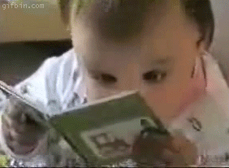

## :wave::smile: Hi There!

My name is Jonathan. I’m a Web Development Student :student:, eager to contribute and create apps that can positively impact people's lives! :eight_spoked_asterisk:

<!-- gif Image -->

### 🌱 I'm challenging myself with:

Since I made contact with the world of development,I have been feeding myself daily with knowledge about web development. :notebook_with_decorative_cover:                                                                                 
* I'm currently trying to dive deeper and deeper into the React Framework. 
* Learning more about typescript.
* Trying some funny web animations.
* Reading Dev articles daily. :newspaper:      

### :desktop_computer: Tools and Languages  
